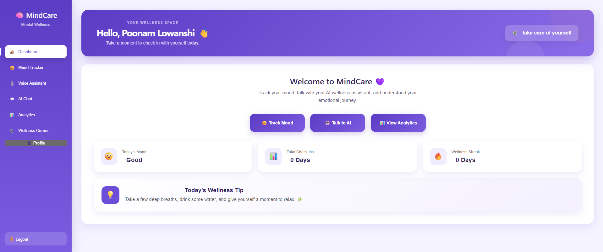
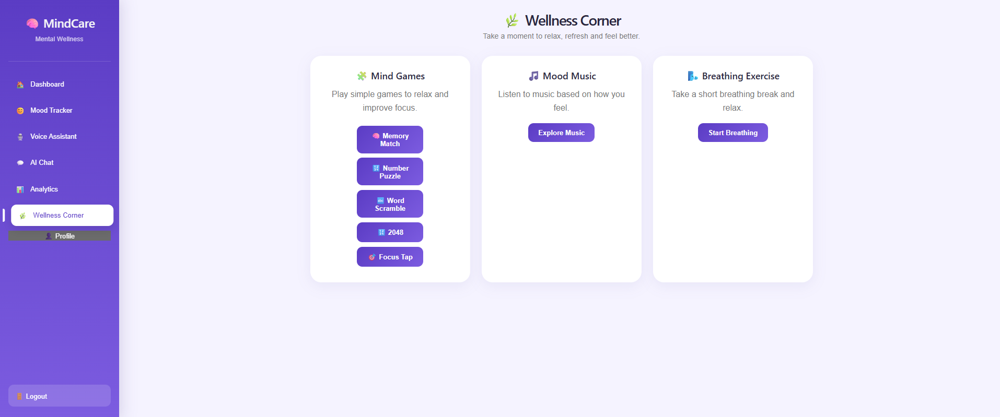
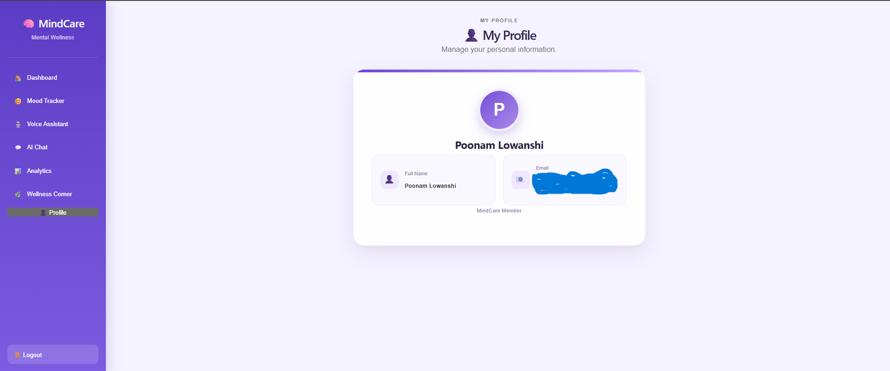

# 🧠 AI Mental Health Support System

An AI-powered mental wellness web application designed to help users track their mood, communicate with an AI wellness companion, practice relaxation activities, and maintain a simple personal wellness record.

> **Note:** This project is developed for educational and wellness-support purposes. It is not a replacement for professional medical or mental-health care.

---

## ✨ Features

* 🔐 User Registration & Login
* 🔒 Secure Password Hashing
* 📊 Personal Wellness Dashboard
* 😊 Mood Tracker
* 📈 Mood History & Analytics
* 🤖 AI Mental Health Assistant
* 🚨 Emergency / Crisis Support
* 🎙️ Voice Assistant
* 📔 Personal Journal
* 🔔 Wellness Reminders & Notifications
* 🌿 Wellness Activities
* 🧩 Mind Games

  * Memory Match
  * Number Puzzle
  * Word Scramble
  * 2048
  * Focus Tap
* 🌬️ Breathing Exercise
* 🎵 Mood-based Music
* 👤 User Profile
* 🌙 Dark Mode
* ⏳ AI Loading & Error States
* 💾 Local SQLite Database

---

## 🛠️ Tech Stack

### Frontend

* React.js
* Vite
* CSS
* Recharts

### Backend

* Python
* FastAPI
* SQLite
* Uvicorn

### AI

* Ollama
* Qwen 2.5 1.5B
* Local AI Processing

### Voice

* Web Speech API
* Speech Recognition
* Speech Synthesis

### Security

* Argon2 Password Hashing
* Pydantic Validation

---

## 📁 Project Structure

```text
AI-MENTAL-HEALTH-SUPPORT/
│
├── backend/
│   ├── main.py
│   ├── db.py
│   └── ...
│
├── frontend/
│   ├── src/
│   │   ├── App.jsx
│   │   ├── App.css
│   │   ├── index.css
│   │   └── main.jsx
│   │
│   ├── public/
│   │   └── music/
│   │
│   ├── package.json
│   └── vite.config.js
│
├── screenshots/
│   ├── dashboard.png
│   ├── mood tracker.png
│   ├── ai chat.png
│   ├── voice assistant.png
│   ├── wellness.png
│   └── profile.png
│
├── .gitignore
├── package.json
├── package-lock.json
└── README.md
```

---

## ⚙️ Requirements

Before running the project, make sure you have:

* Node.js
* Python 3.x
* Ollama
* Qwen 2.5 1.5B model

---

## 🚀 How to Run

### 1. Clone the Repository

```bash
git clone https://github.com/PoonamLowanshi/AI-Mental-Health-Support-System.git
cd AI-Mental-Health-Support-System
```

### 2. Backend Setup

Open a terminal inside the `backend` folder:

```bash
cd backend
py -m venv venv
venv\Scripts\activate
pip install fastapi uvicorn requests "pwdlib[argon2]" email-validator
```

Start the backend:

```bash
py -m uvicorn main:app --reload
```

Backend runs at:

```text
http://127.0.0.1:8000
```

---

### 3. Local AI Setup

Install Ollama and download the Qwen model:

```bash
ollama pull qwen2.5:1.5b
```

Make sure Ollama is running before using the AI Assistant.

---

### 4. Frontend Setup

Open another terminal:

```bash
cd frontend
npm install
npm run dev
```

Frontend runs at:

```text
http://localhost:5173
```

---

## 🤖 How the System Works

The application uses a **React.js frontend** for the user interface and a **FastAPI backend** for authentication, mood tracking, journal entries, reminders, and AI communication.

User data such as mood records and journal entries are stored in a local **SQLite database**.

The AI Mental Health Assistant uses **Ollama with Qwen 2.5 1.5B**, allowing AI responses to be generated locally without sending conversations to a third-party cloud AI API.

The application also includes browser-based voice recognition and speech synthesis for voice interaction.

---

## 📸 Screenshots

### Dashboard



### Mood Tracker


### AI Mental Health Assistant


### Voice Assistant


### Wellness Corner



### User Profile



---

## 🚨 Safety Notice

This application is designed for **educational and wellness-support purposes**.

It does not provide medical diagnosis or professional mental-health treatment.

If someone is experiencing an immediate emergency or is at risk of harming themselves, they should contact local emergency services or a trusted person and seek professional help immediately.

---

## 🔮 Future Scope

* Advanced mood trend prediction
* Personalized AI wellness plans
* AI-powered journal insights
* Monthly wellness reports
* Wellness goals and progress tracking
* Emergency contact integration
* Cloud database integration
* PWA / mobile support
* Production deployment
* Improved accessibility and mobile responsiveness

---

## 👩‍💻 Developer

**Poonam Lowanshi**

B.Tech Computer Science & Engineering
LNCT Bhopal Indore Campus

---

## ⭐ Project Highlights

This project demonstrates practical implementation of:

* Full-stack web development
* REST API development
* Database management
* Authentication and password security
* Local AI integration
* Voice interaction
* Data visualization
* Mood and wellness tracking
* Responsive user interface
* Frontend-backend integration
